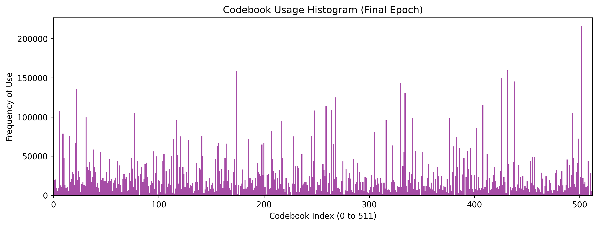
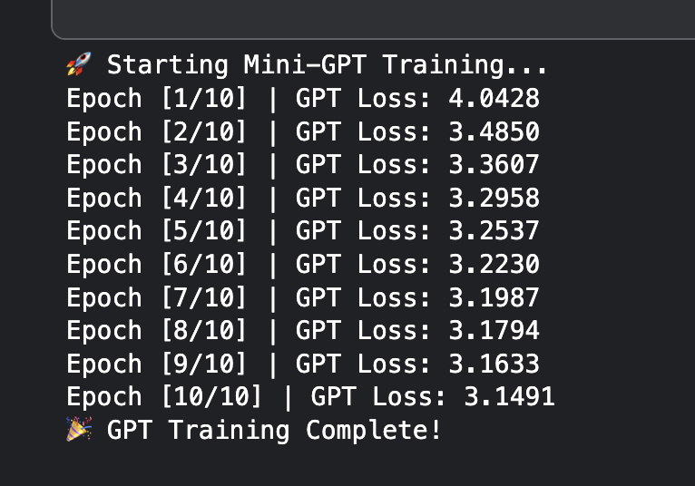
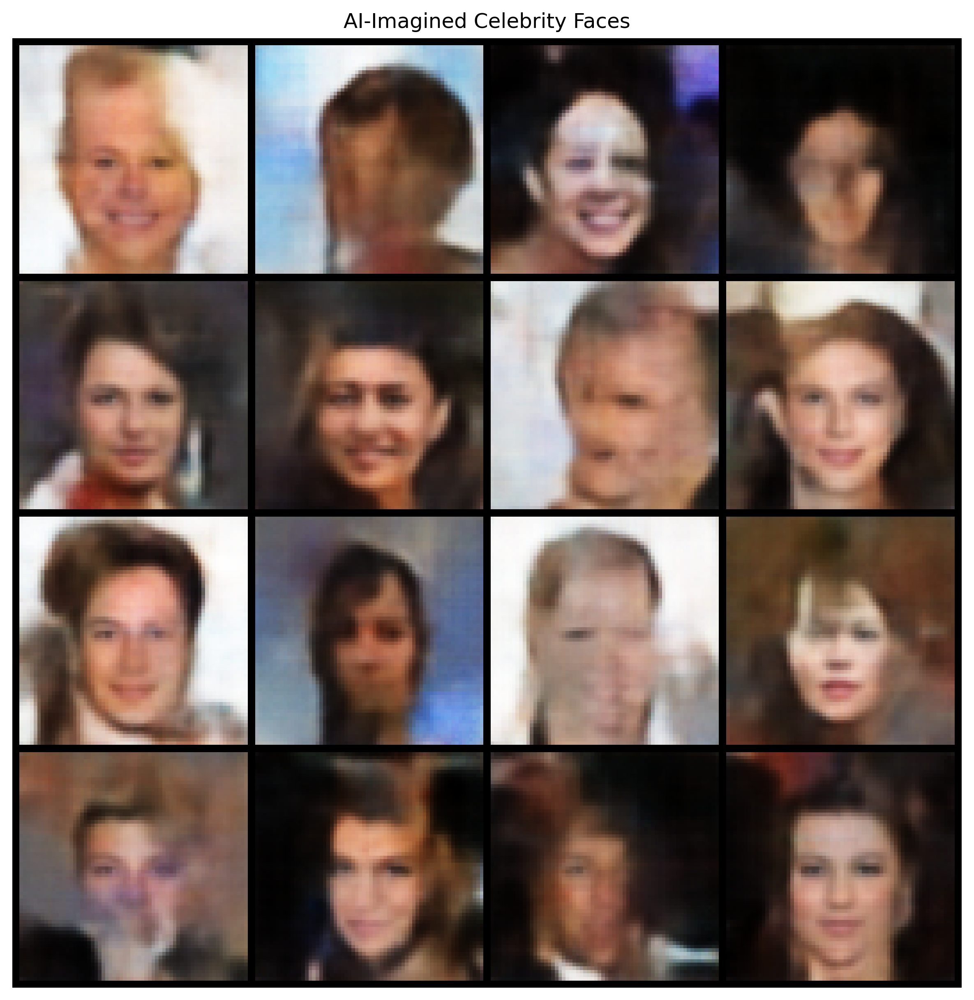

# VQ-VAE + Causal Transformer: End-to-End Autoregressive Face Generation

> Translating pixels into language — and teaching a Transformer to speak it.

A complete, two-stage generative AI pipeline built from scratch in PyTorch. Raw 64×64 CelebA face images are compressed into sequences of 64 discrete integers via a Vector Quantized Variational Autoencoder, then a causal Mini-GPT learns the statistical grammar of those sequences to autoregressively hallucinate novel human faces — one token at a time.

This architecture mirrors the foundational design of OpenAI's original DALL·E.

---

## Table of Contents

- [Motivation](#motivation)
- [System Architecture](#system-architecture)
- [Key Engineering Decisions](#key-engineering-decisions)
- [Results](#results)
- [Failure Analysis & Limitations](#failure-analysis--limitations)
- [Future Directions](#future-directions)
- [Setup & Reproduction](#setup--reproduction)
- [Documentation](#documentation)

---

## Motivation

Standard generative models face a brutal tradeoff: Autoencoders produce disjointed latent spaces that cannot generate new content, and Variational Autoencoders suffer from **Posterior Collapse** when paired with powerful decoders — the network learns to ignore the latent bottleneck entirely, rendering it useless.

The VQ-VAE escapes both failure modes by abandoning continuous probability distributions in favor of a rigid, discrete codebook. Once images are tokenized as sequences of integers, the full generative power of causal Transformers — architectures designed natively for sequences — becomes available for image synthesis.

---

## System Architecture

The pipeline is split into two sequential phases.

### Phase 1 — Spatial Tokenization (VQ-VAE)

The VQ-VAE compresses each 64×64 RGB image into an 8×8 grid of discrete integer indices drawn from a learned codebook of 512 visual words.

```
Input Image [3, 64, 64]
      │
      ▼
Strided Conv Encoder  →  [256, 8, 8] continuous feature map
      │
      ▼
Vector Quantizer (L₂ nearest-neighbor lookup)
      │  ← Straight-Through Estimator bridges gradient gap
      ▼
Discrete Index Grid  [8, 8]  ← 64 tokens from a vocab of 512
      │
      ▼
Transposed Conv Decoder  →  Reconstructed Image [3, 64, 64]
```

**Loss Function (3 components):**

| Loss | Purpose |
|------|---------|
| Reconstruction (MSE) | Trains encoder + decoder end-to-end |
| Codebook Loss | Pulls dictionary vectors toward encoder outputs |
| Commitment Loss | Prevents encoder outputs from drifting erratically |

**EMA Codebook Updates** replace standard gradient-descent optimization of the dictionary. The codebook is updated as an online K-Means clustering problem using an Exponential Moving Average (decay = 0.99) with Laplace smoothing. This completely eliminates dead codes and codebook collapse.

---

### Phase 2 — Sequence Modeling (Mini-GPT)

The 8×8 token grids are flattened into 1D sequences of length 64. A decoder-only causal Transformer learns to predict the next visual token given all previous ones — exactly as a language model predicts the next word.

```
[SOS, 42, 112, 7, 501, 18, ...]  ← sequence of 64 visual tokens
           │
           ▼
      Token Embedding (vocab: 513)
    + Positional Embedding (positions: 0–63)
           │
           ▼
    6× Transformer Blocks
    (8 attention heads, FF dim 1024, causal mask)
           │
           ▼
    Linear → 513 logits → Cross-Entropy Loss
```

**Inference** uses temperature sampling + multinomial selection to introduce controlled diversity, preventing the model from always generating a single generic "average" face.

---

## Key Engineering Decisions

### The Straight-Through Estimator (STE)

The argmax nearest-neighbor lookup is not differentiable — its gradient is zero or undefined everywhere, which would sever the backpropagation chain and make the encoder entirely untrainable.

The STE bypasses this using a single tensor operation:

```python
quantized = encoder_output + (quantized - encoder_output).detach()
```

During the forward pass, this evaluates to `quantized` as expected. During the backward pass, PyTorch ignores the detached term and routes gradients directly from the decoder to the encoder, as if the quantizer never existed.

### EMA Codebook vs. Adam Optimizer

Early training with the Adam optimizer resulted in immediate codebook collapse. Momentum-based updates violently shift active vectors while unused vectors receive no gradients and become permanently stranded. The fix: remove the optimizer from codebook updates entirely and replace it with EMA + Laplace smoothing.

**Result: 512/512 active codebook vectors across all training runs.**

### 8×8 Latent Grid

The 8×8 spatial compression was a deliberate tradeoff:

- Flattens to **64 tokens** — computationally efficient for Transformer attention (O(N²))
- A 16×16 grid would produce 256 tokens, requiring **16× more memory and compute**
- A 4×4 grid (16 tokens) is too aggressive — an entire face cannot be described in 16 patches

### Mixed Precision + GradScaler

Training runs under `torch.autocast` (fp16 for matrix multiplications, fp32 for loss accumulation). A `GradScaler` inflates gradients before the backward pass to prevent underflow, then rescales before the optimizer step. Effective result: ~2× batch size increase and significant speedup via GPU Tensor Cores.

### DataParallel Safety Pattern

`nn.DataParallel` wraps the model in a `.module` container, breaking direct references to internal layers (e.g., the codebook embedding matrix). All checkpoint saves and codebook extractions use a defensive unwrapping pattern:

```python
base_model = model.module if hasattr(model, 'module') else model
```

---

## Results

### VQ-VAE Training

| Metric | Value |
|--------|-------|
| Normalized MSE Reconstruction Loss | 0.0829 |
| Codebook Utilization | **512 / 512 (100%)** |
| Active Epochs | 25 |
| Update Strategy | EMA + Laplace Smoothing |

**Reconstruction & VQ Codebook loss curves:**


> The reconstruction MSE (left) decays sharply and plateaus at **0.0829**. The VQ Codebook loss (right) rises monotonically — this is expected and healthy behavior. As the EMA-updated codebook vectors spread out to cluster increasingly diverse facial features, the average distance between encoder outputs and their nearest codebook entries grows. A codebook that has stopped spreading would indicate collapse, not convergence.

**Codebook utilization histogram — all 512 entries active:**



> Every bar is populated with no zero-gap columns across the full 0–511 index range. The non-uniform distribution (some tokens used far more frequently than others) is natural and meaningful: high-frequency tokens represent common facial patches such as background regions and skin tones, while rarer tokens capture specific textures. This is the direct result of EMA + Laplace smoothing preventing dead codes.

### Mini-GPT Training

| Metric | Value |
|--------|-------|
| Final Cross-Entropy Loss | **3.1491** |
| Random-Guess Baseline | 6.24 (= −ln(1/512)) |
| Effective Vocabulary at Inference | ~23 likely tokens per step |
| Training Epochs | 10 |

A loss of 3.1491 against a random baseline of 6.24 demonstrates the Transformer successfully learned the spatial grammar of human faces — understanding that hair tokens appear at the edges of the sequence, and eye/nose/mouth tokens cluster in the center.

**Mini-GPT training log (epoch-by-epoch convergence):**



### Generated Faces

The system generates structurally coherent faces with correct bilateral symmetry, accurate relative placement of eyes, nose, and mouth, and separated foreground/background regions — purely from autoregressive prediction of 64 integers.



> 16 entirely novel faces autoregressively hallucinated from a single SOS token. The model successfully learned bilateral facial symmetry, correct relative positioning of eyes/nose/mouth, coherent hair and skin color regions, and foreground/background separation — using only a sequence of 64 discrete integers. No face in this grid exists in the CelebA dataset.

*The painterly softness is a mathematically expected consequence of MSE optimization — see [Failure Analysis](#failure-analysis--limitations) below.*

---

## Failure Analysis & Limitations

**Blurriness (MSE Pixel Averaging)**
The VQ-VAE decoder is trained with Mean Squared Error. MSE heavily penalizes misaligned sharp edges (a dark pixel one position to the left of where it should be incurs a massive squared penalty). The network learns to hedge: instead of guessing the exact position of a hair strand, it outputs a smooth medium-brown blur. Sharpness is sacrificed for a statistically safe average.

**Resolution Ceiling (Transformer Sequence Length)**
Generating 256×256 images with this architecture would require a 32×32 latent grid — a sequence of 1,024 tokens. Transformer attention scales as O(N²), so a 1,024-token sequence demands 256× more memory than a 64-token sequence. The architecture is fundamentally bottlenecked by context length.

**Loss of High-Frequency Detail**
Individual hair strands, freckles, and specular eye highlights are averaged out at the compression stage. Each discrete token is responsible for an 8×8 pixel patch — storing the exact arrangement of 64 pixels inside a single vocabulary word is mathematically impossible.

---

## Future Directions

| Upgrade | Limitation Addressed | Mechanism |
|---------|---------------------|-----------|
| **VQGAN** | MSE blurriness | Replaces MSE with Perceptual Loss (LPIPS) + PatchGAN discriminator, forcing sharp textures |
| **VQ-VAE-2** | Resolution ceiling | Hierarchical top/bottom codebooks — global structure and fine detail compressed separately |
| **DALL·E** | Lack of text control | Prepend text token sequence to visual token sequence; train joint Transformer |
| **Latent Diffusion** | Slow autoregressive inference | Replace token-by-token generation with a U-Net denoising process in continuous latent space |

---

## Setup & Reproduction

**Prerequisites**
```bash
pip install torch torchvision numpy matplotlib
```

**Assets**

Place the following files in an `assets/` directory at the repo root for the README images to render correctly:

| File | Description |
|------|-------------|
| `assets/vqvae_loss_curves.png` | Reconstruction + VQ codebook loss curves |
| `assets/codebook_histogram.png` | Codebook utilization histogram |
| `assets/gpt_training_log.png` | Mini-GPT epoch-by-epoch training log |
| `assets/ai_imagined_faces.png` | Grid of autoregressively generated faces |

**Dataset**

Download [CelebA](http://mmlab.ie.cuhk.edu.hk/projects/CelebA.html) and place it in `data/celeba/`. The pipeline applies automatic center-cropping (178px), resizing (64×64), and normalization to [−1, 1] internally.

**Training**

The full pipeline is provided in `vqvae_gpt_celeba.ipynb`. Open in Jupyter or Colab and run sequentially:

1. **Phase 1** — Train the VQ-VAE (recommended: dual T4 GPUs, ~25 epochs)
2. **Extraction** — Run the frozen VQ-VAE over the full dataset to generate `celeba_8x8_latents.npy`
3. **Phase 2** — Train the Mini-GPT on the extracted token sequences (~10 epochs)
4. **Inference** — Autoregressively generate novel faces using temperature sampling

> The pipeline includes automatic mixed-precision, multi-GPU support, and explicit CUDA cache clearing at the start of each training cell to prevent OOM crashes from zombie memory in interactive environments.

---

## Documentation

For an in-depth technical walkthrough covering the architectural derivation from standard Autoencoders through VAEs to VQ-VAE, the mathematics of the Straight-Through Estimator, the EMA codebook engineering, and full experimental analysis, refer to `project_documentation.pdf` included in this repository.

---

**Author:** Vishal | IIT Kharagpur
